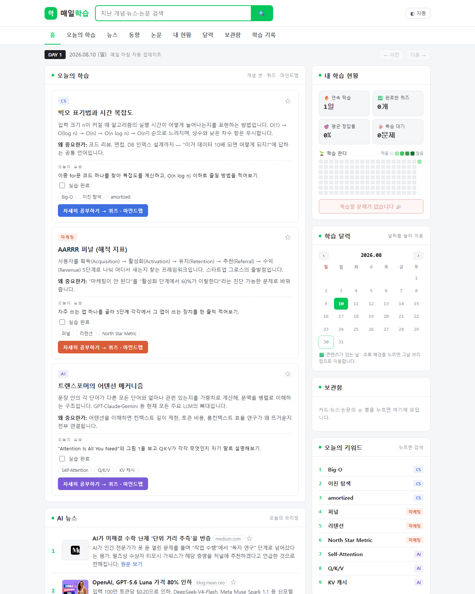
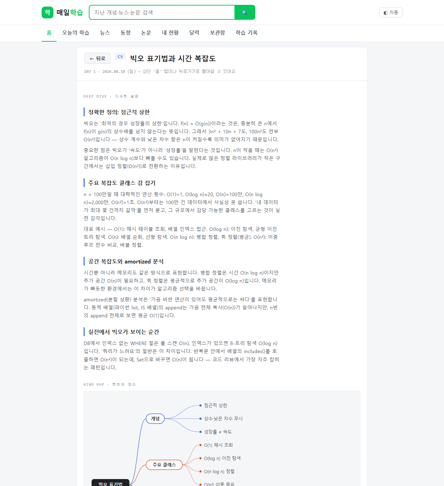
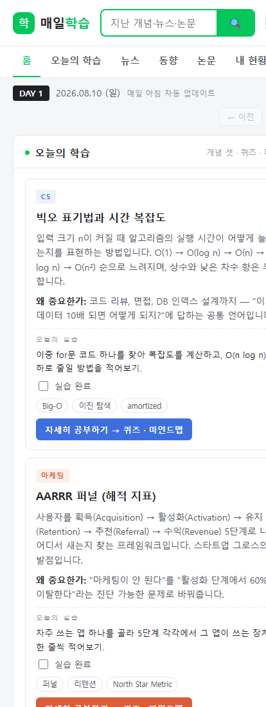
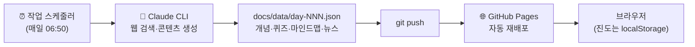

# 📚 매일 학습 브리핑 (Daily Study Briefing)

> CS · 마케팅 · AI를 **매일 아침 자동으로** 큐레이션해주는 개인 학습 포털.
> 개념 딥다이브 → 이해도 퀴즈 → 마인드맵 → AI 뉴스/동향/논문 → 잔디·복습까지, 하루 학습 루틴을 한 페이지에.

**🔗 라이브 사이트: https://hyunaeee.github.io/daily-study-briefing/**

외부 API·백엔드·빌드 도구 없이 **순수 정적 HTML/JS/JSON**으로 동작하며, 매일 아침 로컬 PC의 Claude CLI가 새 콘텐츠를 생성해 push하면 GitHub Pages가 자동 재배포됩니다.

## 미리보기

### 홈 — 포털 레이아웃
오늘의 학습 3개(분야별) + AI 뉴스(썸네일·출처) + 사이드바(학습 현황·잔디·달력·보관함·키워드 랭킹).



### 상세 학습 화면
"자세히 공부하기"를 누르면 전체 화면이 전환됩니다(`#d1-c0` 딥링크 지원). 딥다이브 → SVG 마인드맵 → 4문제 퀴즈(채점·해설) 순서로 학습합니다.



### 모바일
사이드바가 아래로 접히는 1단 반응형 레이아웃.



## ✨ 주요 기능

| 기능 | 설명 |
|---|---|
| 📖 오늘의 학습 | CS·마케팅·AI 각 1개념. 요약 + "왜 중요한가" + 15분 실습 + 키워드 |
| 🔍 통합 검색 | 쌓인 모든 날짜의 개념·뉴스·논문 검색, 결과 클릭 시 해당 상세로 이동 |
| ✅ 이해도 퀴즈 | 개념당 4문제 4지선다, 즉시 채점·해설, 점수는 카드 배지로 표시 |
| 🧠 마인드맵 | 개념 구조를 SVG로 자동 렌더링 (의존성 없는 자체 렌더러) |
| 🌱 학습 잔디 | GitHub 스타일 20주 잔디 — 방문·퀴즈·실습·상세 학습이 활동량으로 누적 |
| 📝 오답 복습 | 틀린 문제 자동 수집 → 다시 풀어 맞히면 목록에서 제거 |
| 📅 학습 달력 | 콘텐츠 있는 날짜 표시, 클릭으로 과거 브리핑 이동 |
| ⭐ 보관함 | 개념·뉴스·논문을 별로 저장, 클릭 한 번에 상세/원문으로 |
| 📰 AI 브리핑 | 뉴스 5건(og:image 썸네일, 원문 링크) + 동향 4개 + 이슈 논문 3편 |
| 🌗 테마 | 자동(시스템)/라이트/다크 토글 |

진도·잔디·보관함은 전부 브라우저 `localStorage`에 저장됩니다 — 서버·로그인 불필요.

## ⚙️ 동작 방식



1. 매일 아침 Windows 작업 스케줄러가 [`personal/update/run-daily-update.ps1`](personal/update/run-daily-update.ps1) 실행
2. Claude CLI(헤드리스)가 [`update-prompt.md`](personal/update/update-prompt.md)에 따라 최신 AI 뉴스·동향·논문을 검색하고, 이전 주제와 겹치지 않는 다음 학습 개념을 골라 하루치 JSON 생성 (기사 og:image 썸네일·논문 링크 포함)
3. `git push` → GitHub Pages 재배포 → 사이트에 새 DAY 반영
4. PC가 꺼져 있던 날은 건너뜀 (다음 실행 때 하루치만 생성)

## 🚀 실행 & 설정

**로컬 미리보기** (배포본과 동일한 `docs/`를 서빙):

```bash
node personal/server.js
```

→ http://localhost:4173

**매일 자동 갱신 등록** (1회, 일반 PowerShell):

```bash
schtasks /Create /TN "DailyStudyBriefing" /TR "powershell -NoProfile -ExecutionPolicy Bypass -File \"C:\Users\LIKE\Desktop\code\self-teaching-project\personal\update\run-daily-update.ps1\"" /SC DAILY /ST 06:50
```

로그는 `personal/update/last-run.log`, 해제는 `schtasks /Delete /TN "DailyStudyBriefing"`.

## 📁 폴더 구조

```
docs/                  # 사이트 본체 = GitHub Pages 배포 소스
  index.html           #   포털 레이아웃 + 전체 스타일 (라이트/다크 토큰)
  js/app.js            #   렌더링·검색·라우팅·잔디·복습·보관함 로직
  js/mindmap.js        #   SVG 마인드맵 렌더러 (의존성 없음)
  data/index.json      #   날짜 목록 (달력·아카이브의 원본)
  data/day-NNN.json    #   하루치 콘텐츠
  assets/              #   README 스크린샷
personal/              # 로컬 도구
  server.js            #   미리보기 서버 (../docs 서빙, :4173)
  update/              #   일일 자동 갱신 (Claude CLI 프롬프트 + 스크립트)
shareable/             # 배포용 템플릿 — 온보딩(닉네임·분야·수준·시간)으로 개인화
```

## 🗺️ 로드맵

- [ ] `shareable/` 멀티유저 버전 — 온보딩 프로필 서버 저장, 분야별 콘텐츠 파이프라인 (상세: [shareable/README.md](shareable/README.md))
- [ ] 수준(입문/중급/심화)별 딥다이브 분기
- [ ] 퀴즈 오답 기반 간격 반복(spaced repetition)

---

Made with [Claude Code](https://claude.com/claude-code) · 콘텐츠는 매일 웹 검색 기반으로 생성되며 각 항목에 출처 링크가 붙습니다.
